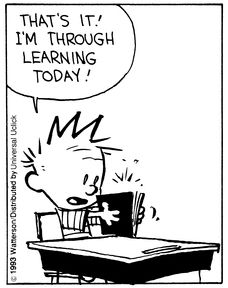

```{r setup, include=FALSE, echo=FALSE}
knitr::opts_knit$set(root.dir="/home/gereon/Courses/2022-HS-GEO812/session6/")
```
## Wrap-up 

 - Reproducibility
 - Tidyverse: Properties × Observations, `%>%`
 - `ggplot(data) + geom_beautiful(aes(x=x, y=y), cmap=viridis)`
 - `??help`
 - `sf` and vector data
 - `raster` data
 - Spatial operations & predicates
 - Lots of plotting
 
## Next days 

 - Please share good project solutions with us!
 - Expect solutions on OLAT around Monday
 - If you were here, you have passed – and thank you for asking some excellent questions!

## Feedback 

Post your feedback on Padlet: https://padlet.com/gereonkaiping/h250a8djbt9fua9f

## It never ends

There are always more methods, more packages, more data. There's probably one that does what you want, don't give up!

Good luck with future R endeavours!
```{r}

```


